# XYLO 데이터베이스 ERD

> 작성일: 2025-01-07
> 스키마: xylo
> 테이블 수: 14개

---

## 📊 Mermaid ERD

```mermaid
erDiagram
    users ||--o{ social_accounts : "연동"
    users ||--o{ youtube_channels : "소유"
    users ||--|| user_points : "포인트"
    users ||--o{ point_history : "일별히스토리"
    users ||--o{ point_transactions : "거래내역"
    users ||--o{ leaderboard_entries : "랭킹"
    users ||--o{ user_nfts : "소유"
    users ||--o{ referrals : "추천인"
    users ||--o{ referrals : "피추천인"
    users ||--o{ event_participations : "참여"

    youtube_channels ||--o{ youtube_videos : "업로드"
    youtube_channels ||--o{ channel_daily_snapshots : "스냅샷"
    youtube_channels ||--o{ leaderboard_entries : "채널랭킹"

    youtube_videos ||--o{ youtube_video_snapshots : "통계스냅샷"

    users {
        uuid id PK
        varchar x_id UK "Twitter ID"
        varchar x_handle "Twitter Handle"
        varchar x_display_name "표시 이름"
        varchar email UK "이메일"
        boolean email_verified "이메일 인증"
        varchar wallet_address UK "지갑 주소"
        text profile_image_url "프로필 이미지"
        varchar referral_code UK "레퍼럴 코드"
        timestamptz joined_at "가입일"
        timestamptz created_at
        timestamptz updated_at
    }

    social_accounts {
        uuid id PK
        uuid user_id FK
        social_platform platform "플랫폼"
        varchar account_id "계정 ID"
        varchar handle "핸들"
        varchar display_name "표시 이름"
        text profile_image "프로필 이미지"
        boolean is_verified "인증 여부"
        boolean is_primary "메인 계정"
        timestamptz connected_at "연동일"
        timestamptz created_at
        timestamptz updated_at
    }

    youtube_channels {
        uuid id PK
        uuid user_id FK
        varchar channel_id UK "채널 ID"
        text channel_url "채널 URL"
        varchar channel_title "채널명"
        text channel_description "설명"
        text thumbnail_url "썸네일"
        integer subscriber_count "구독자"
        integer video_count "비디오 수"
        bigint view_count "조회수"
        varchar verification_code UK "인증 코드"
        boolean is_verified "인증 여부"
        timestamptz verified_at "인증일"
        timestamptz created_at
        timestamptz updated_at
    }

    youtube_videos {
        uuid id PK
        uuid channel_id FK
        varchar video_id UK "비디오 ID"
        varchar title "제목"
        text description "설명"
        text thumbnail_url "썸네일"
        timestamptz published_at "업로드일"
        integer duration "길이(초)"
        integer view_count "조회수"
        integer like_count "좋아요"
        integer comment_count "댓글수"
        text_array tags "태그"
        boolean is_shorts "Shorts 여부"
        boolean is_eligible "포인트 대상"
        timestamptz created_at
        timestamptz updated_at
    }

    youtube_video_snapshots {
        uuid id PK
        uuid video_id FK
        date snapshot_date UK "스냅샷 날짜"
        integer view_count "조회수"
        integer like_count "좋아요"
        integer comment_count "댓글수"
        timestamptz created_at
    }

    channel_daily_snapshots {
        uuid id PK
        uuid channel_id FK
        date snapshot_date UK "스냅샷 날짜"
        integer subscriber_count "구독자"
        integer video_count "비디오 수"
        bigint view_count "조회수"
        integer rank "순위"
        timestamptz created_at
    }

    user_points {
        uuid id PK
        uuid user_id UK,FK
        integer total_points "총 포인트"
        integer slot_01_content "콘텐츠"
        integer slot_02_mgm "MGM"
        integer slot_03_event "이벤트"
        integer slot_04_profit "수익"
        integer slot_05_sponsor "스폰서"
        integer slot_06_boost "부스트"
        integer sbt_value "SBT 밸류"
        timestamptz last_calculated "마지막 계산"
        timestamptz created_at
        timestamptz updated_at
    }

    point_history {
        uuid id PK
        uuid user_id FK
        date date UK "날짜"
        integer day_total "일 합계"
        integer contents "콘텐츠"
        integer referral "레퍼럴"
        integer event "이벤트"
        integer profit "수익"
        integer boost "부스트"
        timestamptz created_at
    }

    point_transactions {
        uuid id PK
        uuid user_id FK
        point_category category "카테고리"
        integer amount "수량"
        text reason "사유"
        jsonb metadata "메타데이터"
        timestamptz created_at
    }

    leaderboard_entries {
        uuid id PK
        uuid user_id FK
        uuid channel_id FK
        leaderboard_period period "기간"
        integer rank UK "순위"
        integer total_current "총 포인트"
        integer contents "콘텐츠"
        integer mgm "MGM"
        integer event "이벤트"
        integer profit "수익"
        integer boost "부스트"
        varchar channel_title "채널명"
        text channel_image_url "채널 이미지"
        varchar x_handle "X 핸들"
        text profile_image_url "프로필 이미지"
        date snapshot_date UK "스냅샷 날짜"
        timestamptz created_at
    }

    user_nfts {
        uuid id PK
        uuid user_id FK
        nft_type nft_type "NFT 타입"
        bigint token_id "토큰 ID"
        varchar contract_address "컨트랙트 주소"
        integer chain_id "체인 ID"
        varchar name "이름"
        text description "설명"
        text image_url "이미지"
        integer tier "티어"
        jsonb metadata "메타데이터"
        boolean is_burned "소각 여부"
        timestamptz burned_at "소각일"
        timestamptz minted_at "발행일"
        timestamptz created_at
        timestamptz updated_at
    }

    referrals {
        uuid id PK
        uuid referrer_id FK "추천인"
        uuid referee_id FK "피추천인"
        varchar referral_code "레퍼럴 코드"
        boolean is_joined "가입 완료"
        boolean is_discord_joined "디스코드 가입"
        boolean is_video_posted "영상 업로드"
        boolean is_completed "완료 여부"
        timestamptz completed_at "완료일"
        timestamptz created_at
    }

    event_participations {
        uuid id PK
        uuid user_id FK
        event_type event_type "이벤트 타입"
        varchar event_id "이벤트 ID"
        varchar event_name "이벤트명"
        integer vote_weight "투표권"
        text submission_url "제출 URL"
        boolean is_winner "당선 여부"
        varchar prize "상금"
        timestamptz participated_at "참여일"
        timestamptz created_at
    }

    system_configs {
        varchar key PK
        jsonb value "값"
        text description "설명"
        timestamptz updated_at
    }
```



---

## 🎨 관계 요약

### 1️⃣ 사용자 중심 관계

| 테이블 | 관계 | 설명 |
|--------|------|------|
| `users` → `social_accounts` | 1:N | 한 사용자가 여러 소셜 계정 연동 가능 |
| `users` → `youtube_channels` | 1:N | 한 사용자가 여러 유튜브 채널 등록 가능 |
| `users` ↔ `user_points` | 1:1 | 한 사용자당 하나의 포인트 집계 레코드 |
| `users` → `point_history` | 1:N | 일별 포인트 히스토리 |
| `users` → `point_transactions` | 1:N | 포인트 거래 내역 |
| `users` → `leaderboard_entries` | 1:N | 리더보드 스냅샷 (여러 기간) |
| `users` → `user_nfts` | 1:N | 사용자가 소유한 NFT 목록 |
| `users` → `referrals` (추천인) | 1:N | 추천한 사용자 목록 |
| `users` → `referrals` (피추천인) | 1:N | 추천받은 기록 |
| `users` → `event_participations` | 1:N | 이벤트 참여 내역 |

### 2️⃣ YouTube 관련 관계

| 테이블 | 관계 | 설명 |
|--------|------|------|
| `youtube_channels` → `youtube_videos` | 1:N | 채널의 비디오 목록 |
| `youtube_channels` → `channel_daily_snapshots` | 1:N | 채널 일별 통계 스냅샷 |
| `youtube_channels` → `leaderboard_entries` | 1:N | 채널별 리더보드 엔트리 |
| `youtube_videos` → `youtube_video_snapshots` | 1:N | 비디오 일별 통계 스냅샷 |

### 3️⃣ 포인트 시스템 관계

| 테이블 | 관계 | 설명 |
|--------|------|------|
| `point_transactions` → `user_points` | N:1 | 트랜잭션이 user_points 자동 업데이트 (트리거) |
| `point_transactions` → `point_history` | N:N | 일별 집계로 히스토리 생성 |

---

## 📐 dbdiagram.io 코드

아래 코드를 https://dbdiagram.io/ 에 붙여넣으면 시각적 ERD를 확인할 수 있습니다.

```dbml
// XYLO Database Schema
// Created: 2025-01-07

Table users {
  id uuid [pk, default: `gen_random_uuid()`]
  x_id varchar(255) [unique, not null, note: 'Twitter ID']
  x_handle varchar(255) [not null, note: 'Twitter Handle']
  x_display_name varchar(255)
  email varchar(255) [unique]
  email_verified boolean [default: false]
  wallet_address varchar(42) [unique]
  profile_image_url text
  referral_code varchar(20) [unique, not null, note: '6자리 영숫자']
  joined_at timestamptz [not null, default: `now()`]
  created_at timestamptz [not null, default: `now()`]
  updated_at timestamptz [not null, default: `now()`]

  indexes {
    x_id [unique]
    email [unique]
    referral_code [unique]
  }
}

Table social_accounts {
  id uuid [pk, default: `gen_random_uuid()`]
  user_id uuid [ref: > users.id, not null]
  platform social_platform [not null, note: 'X, YOUTUBE, INSTAGRAM, DISCORD']
  account_id varchar(255) [not null]
  handle varchar(255)
  display_name varchar(255)
  profile_image text
  is_verified boolean [default: false]
  is_primary boolean [default: false]
  connected_at timestamptz [not null, default: `now()`]
  created_at timestamptz [not null, default: `now()`]
  updated_at timestamptz [not null, default: `now()`]

  indexes {
    user_id
    platform
    (user_id, platform, account_id) [unique]
  }
}

Table youtube_channels {
  id uuid [pk, default: `gen_random_uuid()`]
  user_id uuid [ref: > users.id, not null]
  channel_id varchar(255) [unique, not null, note: 'YouTube Channel ID (UC...)']
  channel_url text [not null]
  channel_title varchar(255)
  channel_description text
  thumbnail_url text
  subscriber_count integer [default: 0]
  video_count integer [default: 0]
  view_count bigint [default: 0]
  verification_code varchar(50) [unique, note: 'XYLO-XXXXXXXX']
  is_verified boolean [default: false]
  verified_at timestamptz
  created_at timestamptz [not null, default: `now()`]
  updated_at timestamptz [not null, default: `now()`]

  indexes {
    user_id
    is_verified
    channel_id [unique]
  }
}

Table youtube_videos {
  id uuid [pk, default: `gen_random_uuid()`]
  channel_id uuid [ref: > youtube_channels.id, not null]
  video_id varchar(255) [unique, not null, note: 'YouTube Video ID']
  title varchar(500)
  description text
  thumbnail_url text
  published_at timestamptz
  duration integer [note: '비디오 길이 (초)']
  view_count integer [default: 0]
  like_count integer [default: 0]
  comment_count integer [default: 0]
  tags text[]
  is_shorts boolean [default: false, note: '60초 이하']
  is_eligible boolean [default: false, note: '포인트 적립 대상 (#WITCHES, #XYLO)']
  created_at timestamptz [not null, default: `now()`]
  updated_at timestamptz [not null, default: `now()`]

  indexes {
    channel_id
    published_at
    video_id [unique]
  }
}

Table youtube_video_snapshots {
  id uuid [pk, default: `gen_random_uuid()`]
  video_id uuid [ref: > youtube_videos.id, not null]
  snapshot_date date [not null]
  view_count integer [default: 0]
  like_count integer [default: 0]
  comment_count integer [default: 0]
  created_at timestamptz [not null, default: `now()`]

  indexes {
    video_id
    snapshot_date
    (video_id, snapshot_date) [unique]
  }
}

Table channel_daily_snapshots {
  id uuid [pk, default: `gen_random_uuid()`]
  channel_id uuid [ref: > youtube_channels.id, not null]
  snapshot_date date [not null]
  subscriber_count integer [default: 0]
  video_count integer [default: 0]
  view_count bigint [default: 0]
  rank integer
  created_at timestamptz [not null, default: `now()`]

  indexes {
    channel_id
    snapshot_date
    (channel_id, snapshot_date) [unique]
  }
}

Table user_points {
  id uuid [pk, default: `gen_random_uuid()`]
  user_id uuid [ref: - users.id, unique, not null, note: '1:1 관계']
  total_points integer [not null, default: 0, note: 'SLOT-01~06 합계']
  slot_01_content integer [not null, default: 0, note: '콘텐츠 확산']
  slot_02_mgm integer [not null, default: 0, note: '신규 팬 유입']
  slot_03_event integer [not null, default: 0, note: '팬 협업 이벤트']
  slot_04_profit integer [not null, default: 0, note: '실물 판매형 수익']
  slot_05_sponsor integer [not null, default: 0, note: '브랜드 협찬']
  slot_06_boost integer [not null, default: 0, note: 'MVP 종료 후 Boost']
  sbt_value integer [not null, default: 0, note: 'SLOT-01~05 합계']
  last_calculated timestamptz [not null, default: `now()`]
  created_at timestamptz [not null, default: `now()`]
  updated_at timestamptz [not null, default: `now()`]

  indexes {
    user_id [unique]
    total_points
    sbt_value
  }
}

Table point_history {
  id uuid [pk, default: `gen_random_uuid()`]
  user_id uuid [ref: > users.id, not null]
  date date [not null, note: '일별 집계 날짜']
  day_total integer [not null, default: 0]
  contents integer [not null, default: 0]
  referral integer [not null, default: 0, note: 'MGM']
  event integer [not null, default: 0]
  profit integer [not null, default: 0]
  boost integer [not null, default: 0]
  created_at timestamptz [not null, default: `now()`]

  indexes {
    (user_id, date)
    date
    (user_id, date) [unique]
  }
}

Table point_transactions {
  id uuid [pk, default: `gen_random_uuid()`]
  user_id uuid [ref: > users.id, not null]
  category point_category [not null, note: 'CONTENT, MGM, EVENT, PROFIT, SPONSOR, BOOST']
  amount integer [not null, note: '양수: 획득, 음수: 차감']
  reason text
  metadata jsonb [note: 'video_id, referral_id 등']
  created_at timestamptz [not null, default: `now()`]

  indexes {
    (user_id, created_at)
    category
    created_at
  }
}

Table leaderboard_entries {
  id uuid [pk, default: `gen_random_uuid()`]
  user_id uuid [ref: > users.id, not null]
  channel_id uuid [ref: > youtube_channels.id]
  period leaderboard_period [not null, note: 'ALL, 1D, 1W, 1M, 3M']
  rank integer [not null]
  total_current integer [not null, note: '총 포인트']
  contents integer [not null]
  mgm integer [not null]
  event integer [not null]
  profit integer [not null]
  boost integer [not null]
  channel_title varchar(255)
  channel_image_url text
  x_handle varchar(255)
  profile_image_url text
  snapshot_date date [not null]
  created_at timestamptz [not null, default: `now()`]

  indexes {
    (period, rank)
    user_id
    channel_id
    snapshot_date
    (period, rank, snapshot_date) [unique]
  }
}

Table user_nfts {
  id uuid [pk, default: `gen_random_uuid()`]
  user_id uuid [ref: > users.id, not null]
  nft_type nft_type [not null, note: 'SBT, TIER, REWARD, CONNECTION']
  token_id bigint
  contract_address varchar(42)
  chain_id integer [default: 80001, note: '80001: Mumbai, 137: Polygon']
  name varchar(255)
  description text
  image_url text
  tier integer [note: '1~5 (TIER 타입만)']
  metadata jsonb
  is_burned boolean [default: false]
  burned_at timestamptz
  minted_at timestamptz
  created_at timestamptz [not null, default: `now()`]
  updated_at timestamptz [not null, default: `now()`]

  indexes {
    user_id
    nft_type
    (contract_address, token_id)
  }
}

Table referrals {
  id uuid [pk, default: `gen_random_uuid()`]
  referrer_id uuid [ref: > users.id, not null, note: '추천인 (포인트 +2P)']
  referee_id uuid [ref: > users.id, not null, note: '피추천인 (포인트 +1P)']
  referral_code varchar(20) [not null]
  is_joined boolean [default: false, note: '1단계: 커뮤니티 가입']
  is_discord_joined boolean [default: false, note: '2단계: 디스코드 가입']
  is_video_posted boolean [default: false, note: '3단계: 영상 업로드 (필수 태그)']
  is_completed boolean [default: false, note: '모든 조건 완료']
  completed_at timestamptz
  created_at timestamptz [not null, default: `now()`]

  indexes {
    referrer_id
    referee_id
    referral_code
    is_completed
    (referrer_id, referee_id) [unique]
  }
}

Table event_participations {
  id uuid [pk, default: `gen_random_uuid()`]
  user_id uuid [ref: > users.id, not null]
  event_type event_type [not null, note: 'VOTE, CONTEST, COMMUNITY']
  event_id varchar(255) [not null]
  event_name varchar(255)
  vote_weight integer [note: '투표권 (누적 포인트에 비례, 100P당 1표)']
  submission_url text
  is_winner boolean [default: false]
  prize varchar(255)
  participated_at timestamptz [not null, default: `now()`]
  created_at timestamptz [not null, default: `now()`]

  indexes {
    user_id
    event_type
    event_id
  }
}

Table system_configs {
  key varchar(255) [pk]
  value jsonb [not null]
  description text
  updated_at timestamptz [not null, default: `now()`]

  note: 'mvp_end_date, boost_points, required_tags, point_rules 등'
}

// Enums
Enum social_platform {
  X
  YOUTUBE
  INSTAGRAM
  DISCORD
}

Enum point_category {
  CONTENT
  MGM
  EVENT
  PROFIT
  SPONSOR
  BOOST
}

Enum leaderboard_period {
  ALL
  "1D"
  "1W"
  "1M"
  "3M"
}

Enum nft_type {
  SBT
  TIER
  REWARD
  CONNECTION
}

Enum event_type {
  VOTE
  CONTEST
  COMMUNITY
}
```

---

## 🔑 핵심 관계 설명

### 1. 사용자와 포인트 시스템

```
users (1) ←→ (1) user_points
  ↓
  └─→ (N) point_transactions
         └─→ [TRIGGER] → user_points 자동 업데이트
  ↓
  └─→ (N) point_history (일별 집계)
```

**흐름**:
1. 포인트 거래 발생 → `point_transactions` INSERT
2. PostgreSQL 트리거 자동 실행
3. `user_points` 테이블의 슬롯별 포인트 자동 합산
4. 매일 자정 배치로 `point_history` 일별 집계 생성

---

### 2. YouTube 채널과 통계 시스템

```
youtube_channels (1) ─→ (N) youtube_videos
  ↓                           ↓
  └─→ (N) channel_daily_snapshots   └─→ (N) youtube_video_snapshots
```

**흐름**:
1. YouTube Data API로 채널/비디오 정보 크롤링 (매일 02:00 AM)
2. 일별 스냅샷 생성 (채널/비디오)
3. 전날 스냅샷과 비교하여 증가분 계산 (03:00 AM)
4. 증가분 기반 포인트 지급

---

### 3. 리더보드 시스템

```
users (1) ─→ (N) leaderboard_entries ←─ (N) youtube_channels
```

**특징**:
- **채널 기반 랭킹**: 사용자별이 아닌 채널별 랭킹
- 한 사용자가 여러 채널 소유 가능 → 각 채널별로 리더보드 엔트리 생성
- 스냅샷 패턴: 매일/주/월 단위로 스냅샷 생성하여 히스토리 보존
- 기간별 필터링: ALL, 1D, 1W, 1M, 3M

---

### 4. 레퍼럴 시스템

```
users (추천인) ─→ (N) referrals ←─ (N) users (피추천인)
```

**자기 참조 관계**:
- `referrals.referrer_id` → `users.id` (추천한 사람)
- `referrals.referee_id` → `users.id` (추천받은 사람)
- 3단계 완료 조건 체크 후 포인트 자동 지급

---

## 📈 테이블 크기 및 성장 예측

| 테이블 | 초기 레코드 | 1년 후 예상 | 인덱스 수 |
|--------|------------|------------|----------|
| `users` | 100 | 10,000 | 4 |
| `youtube_channels` | 50 | 5,000 | 3 |
| `youtube_videos` | 500 | 50,000 | 4 |
| `youtube_video_snapshots` | 0 | 18M (365일 × 50K) | 2 |
| `channel_daily_snapshots` | 0 | 1.8M (365일 × 5K) | 2 |
| `user_points` | 100 | 10,000 | 3 |
| `point_transactions` | 0 | 500K | 3 |
| `point_history` | 0 | 3.6M (365일 × 10K) | 2 |
| `leaderboard_entries` | 0 | 900K (365일 × 5기간 × 500등) | 4 |

**총 예상 레코드** (1년 후): ~23M 레코드

---

## 🎯 성능 최적화 포인트

### 1. 인덱스 전략
- 모든 FK에 인덱스 적용
- 복합 유니크 인덱스 활용 (`user_id, date`)
- 정렬 컬럼에 DESC 인덱스 (`published_at DESC`, `created_at DESC`)

### 2. 파티셔닝 계획 (향후)
- `point_transactions`: 월별 파티셔닝
- `point_history`: 월별 파티셔닝
- `youtube_video_snapshots`: 월별 파티셔닝
- `leaderboard_entries`: 기간별 파티셔닝

### 3. 캐싱 전략
- `leaderboard_entries`: Redis 캐싱 (실시간 조회)
- `user_points`: 애플리케이션 레벨 캐싱
- `system_configs`: 메모리 캐싱

---

## 📝 참고 사항

- **CASCADE 삭제**: 사용자 삭제 시 관련 데이터 모두 삭제
- **트리거 함수**: `update_user_points()` - 포인트 자동 집계
- **CHECK 제약**: 포인트는 항상 0 이상, NFT 티어는 1~5
- **JSONB 활용**: metadata, system_configs (유연한 스키마)
- **타임존**: 모든 timestamptz는 UTC+9 (Asia/Seoul) 기준

---
